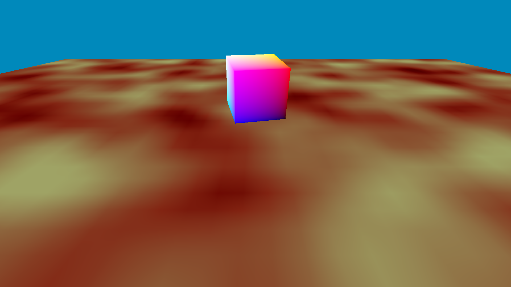
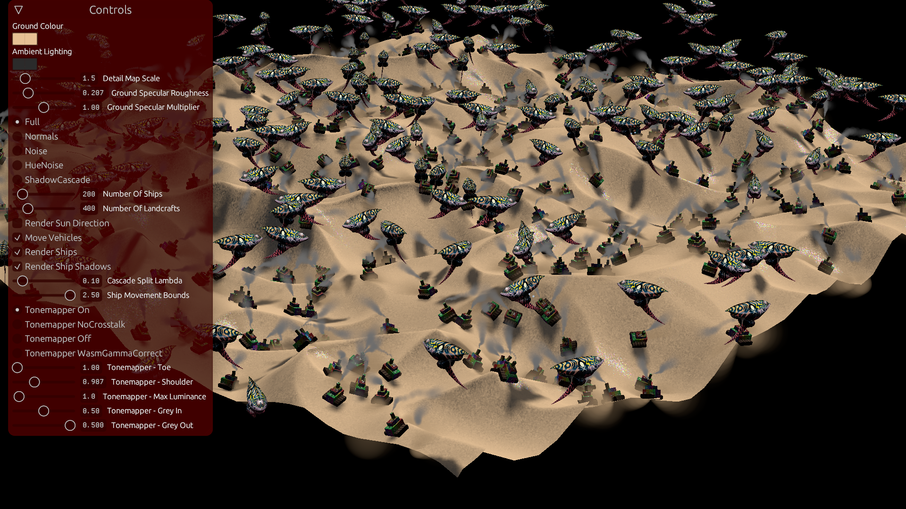
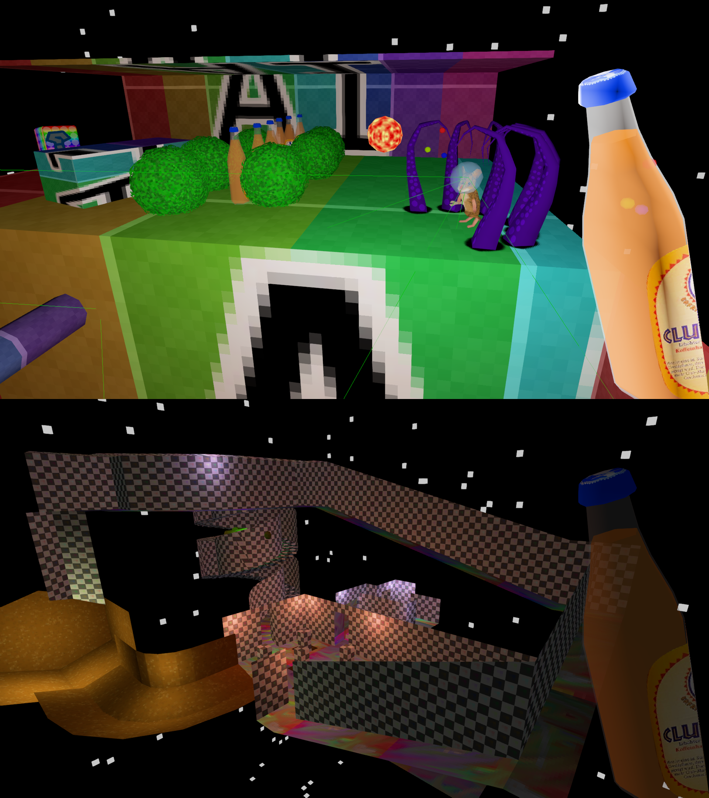
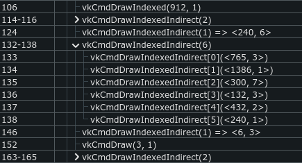
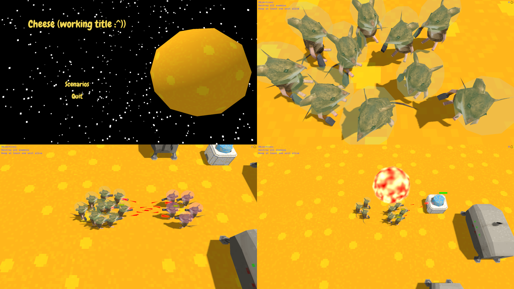
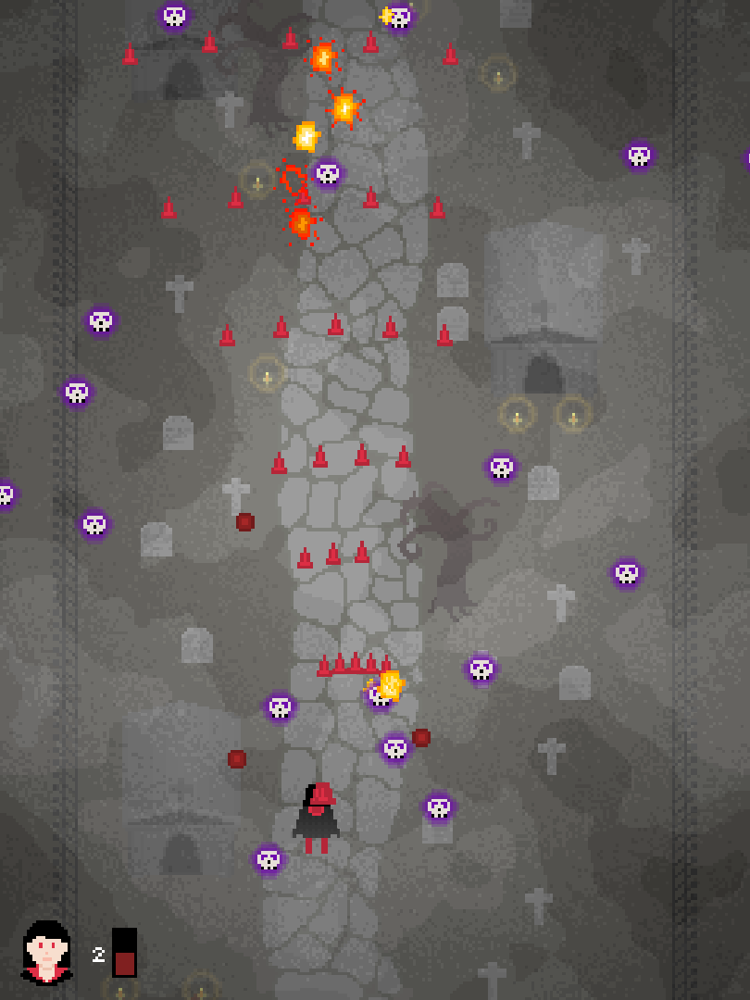
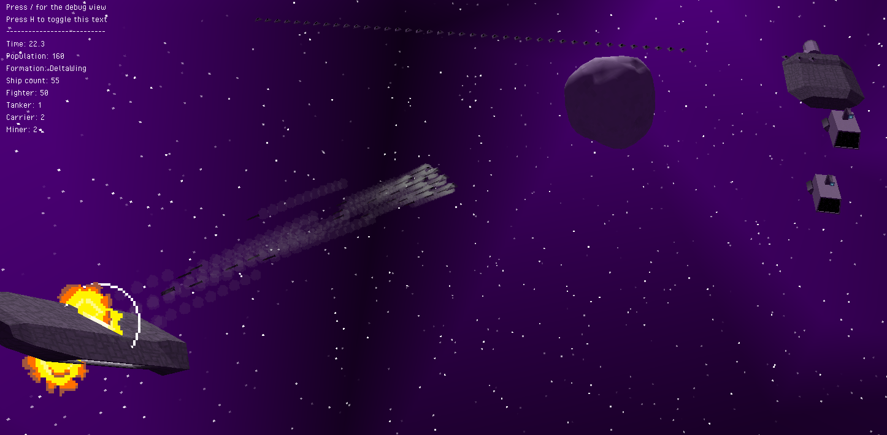
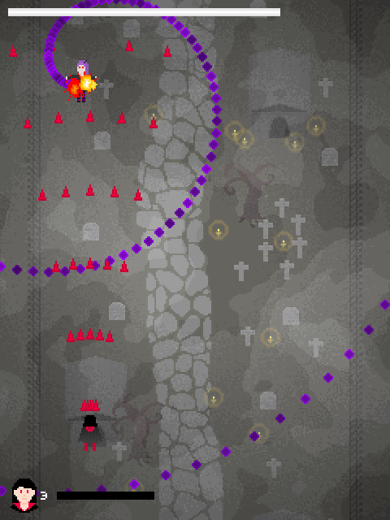
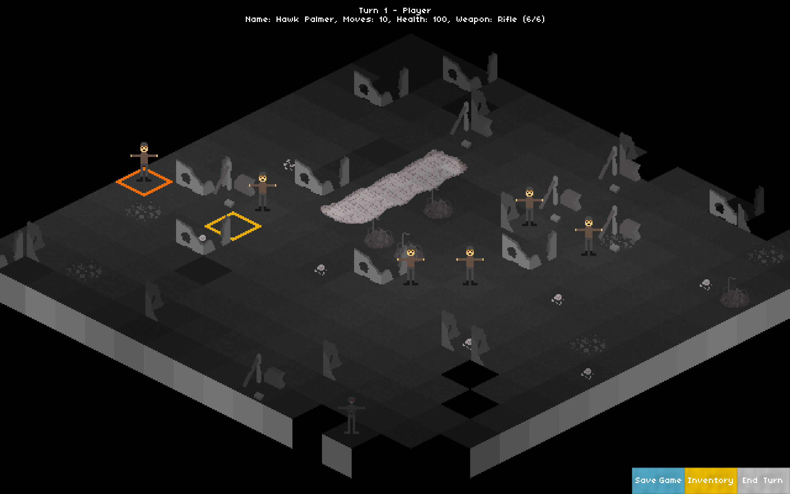

# Ashley's Portfolio

Here's a list of things I've created/worked on/etc over the last few years.

## [Vulkan Base](https://github.com/expenses/vulkan-base) (2021 - Present)

- Rust with Vulkan via the [ash] crate

I now know Vulkan too! Having learnt [wgpu-rs], I had a pretty good grasp of the basic Vulkan concepts, _except_ most of the ones that vulkan-tutorial.com goes through in the 3 - 7 hours before you've actually gotten anything drawn on a window. Now having created this base for vulkan projects, I have a bit of a better idea about synchronisation and the like.

## [Dune Scene](https://github.com/expenses/dune_scene) (2021 - Present)

- Rust with [wgpu-rs]
- 3400 lines of code (2500 rust, 900 glsl)

An ongoing experiment in seeing how much stuff I can animate in a browser using compute shaders. I also have [a pull request up](https://github.com/expenses/dune_scene/pull/1) that adds compute shaders for the full animation pipeline, from sampling animation to computing the joint transforms. I haven't seen anyone do this before (perhaps for good reason) and I'm super proud of the system I came up with. The Shadows are rendered via Cascaded Shadow Maps, which I implemented [based on the Sascha Willems Vulkan example](https://github.com/SaschaWillems/Vulkan/tree/master/examples/shadowmappingcascade). This is also the first time I've played around with PBR BRDFs in shaders (albeit ones that I copy-pasted).

Playable online at expenses.github.io/dune_scene using [a browser with webgpu enabled], although this could break at any time.

## [An Untitled Fps Thing](https://github.com/expenses/fps/) (2020 - 2021)

- Rust with [wgpu-rs]
- ~ 6600 lines of code (6000 rust, 600 glsl)

A first-person thing that I started and have a decent renderer for, but barely made any progress on in terms of gameplay. It has this cool system where I create 'empty' objects in blender with custom properties that get exported to the [gltf] file and then are capable of spawning entities. I have one shader that makes lightmaps for the static level, and a compute shader that creates a 'light volume' that is used to light everything else, kinda similar to what Quake 3 does. And yes, that is a club mate gun.

Objects can either be static or animated, and either opaque, alpha-clipped or alpha-blended. They are rendered using Multi-Draw Indirect, so a maximum of 6 draw calls are sent out to render all objects, which is a system that I think is super cool. Animated objects are animated via a [gltf skinning crate](https://github.com/expenses/fps/blob/master/crates/animation/src/lib.rs) of my own design, which took some effort to write because animations are super hard to debug, but I fully understand all of it now which is great. After this I kinda decided that I didn't like gameplay programming at all.

## [Cheese](https://github.com/expenses/cheese) (2020)

- Rust with [wgpu-rs]
- ~ 9000 lines of code (8500 rust, 400 glsl)

A Real Time Strategy Game I made for the 2020 Github Game Off. I put a ton of work into this over the course of the month, and I think it shows. RTSes are definitely not the most fun kind of game (for me) to write, and I got pretty burnt-out towards the end of this. I learnt a ton about writing shaders and effects such as bloom and shadows. The shadow implementation could definitely be better, I might switch it to Cascaded Shadow Maps at some point.

Playable online at expenses.github.io/cheese using [a browser with webgpu enabled], although this could break at any time.

## [Hectic-rs](https://github.com/expenses/hectic-rs) (2020)

- Rust with [wgpu-rs]
- ~ 2500 lines of code

A rewrite of [Hectic](#hectic-2017) below. My first time trying out a more modern graphics API in the form of [wgpu-rs], which fixed a ton of my problems with OpenGL. Features a bunch of improvements such as being able to change the window size and rotated projectiles etc. Definitely doesn't have a perfect renderer for a 2D game, but I'm learning :P.

Playable online at expenses.github.io/hectic-rs-wasm using [a browser with webgpu enabled], although this could break at any time.

## [Nebulawar](https://github.com/expenses/nebulawar) (2018, 2020)

- Rust and OpenGL
- Updated to wgpu-rs in 2020.
- ~ 4000 lines of code

My first foray into 3D graphics programming. I didn't get very far in terms of actual gameplay, but at least it looks quite pretty. Has some fun randomly generated things like a randomly background mesh that consists of points on a sphere [similar to what Homeworld 1 & 2 do](https://simonschreibt.de/gat/homeworld-2-backgrounds/).

## [Hectic](https://github.com/expenses/hectic) (2017)

- [Processing]
- ~ 1200 lines of code

A small bullet hell game I made for a computer graphics course. It's pretty cool, and I'm still quite proud of it. I came up with this binary search thing so that enemies followed spline curves at a constant speed which I think was a neat invention. Also see [Hectic-rs](#hectic-rs-2020) above.

## [War Against Machines](https://github.com/expenses/war-against-machines/) (2017 - 2018)

- Rust and OpenGL
- ~ 5000 lines of code

My first foray into graphics programming. Doesn't reflect my current abilities! It has networked multiplayer which is pretty cool. I didn't do a good job of fixing dependency versions, so it's not actually runnable at present.

[a browser with webgpu enabled]: https://github.com/gpuweb/gpuweb/wiki/Implementation-Status#firefox
[Processing]: https://processing.org/
[wgpu-rs]: https://github.com/gfx-rs/wgpu-rs
[gltf]: https://github.com/KhronosGroup/glTF
[ash]: https://crates.io/crates/ash
